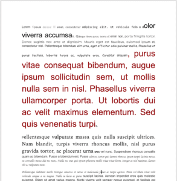

Consider these two pieces of texts.



Which text in your opinion is easier to read?

Which text would take you less time to understand?

Which text would be easier to proofread and correct mistakes?

Which text would be easier to continue writing on?

You got it, the answer is the one on the left. And the reason for this is consistency.

#### For this very reason it is important to have unified code style across projects.

Sure the typeface doesn’t change, sure the colors are the same and the size is constant, but the underlying style
changes.

Things that you have grown accustomed to are not where you would expect them, which causes frustration.

Having a unified code style helps improve readability and reduces the difficulty when transferring to a new
project.

There are two major tools for PHP that help solve this problem. Both are equally good, and provide detection along
with automagic correction (when possible).

The tools are [phpcs](https://github.com/squizlabs/PHP_CodeSniffer) and
[php-cs-fixer](https://github.com/FriendsOfPHP/PHP-CS-Fixer)

Up until now we used phpcs, but since we switched to Symfony – we are also switching to php-cs-fixer which provides
better symfony coding standard support.

Both tools allow for great tweaking and for writing custom rules.

For now, our code style for Symfony project extends Symfony code style rules, with a few tweaks.

```
<?php
return PhpCsFixer\Config::create()
    ->setRules([
        '@Symfony' => true,
        'array_syntax' => ['syntax' => 'short'],
        'concat_space' => ['spacing' => 'one'],
        'yoda_style' => false,
    ])
;

```

This file is part of the source code in the repository, and php-cs-fixer reads it as it’s configuration.

In the future we might put this file in our public
[php-coding-standards](https://github.com/bornfight/php-coding-standards) repository, so all projects have the same
ruleset.

PHPStorm has nice built-in support for php-cs-fixer, so be sure to hook it up. You can find details on how to do so
on [this article](https://www.jetbrains.com/help/phpstorm/using-php-cs-fixer.html). If you are working on older
projects which use phpcs, don’t panic – PHPStorm has you covered, read
[this article](https://github.com/FriendsOfPHP/PHP-CS-Fixer) on how to setup phpcs in PHPStorm.

Remember, our CI checks code style to see if everything is ok, and will give you a notice on Github PR’s if you
forgot about the code style. This keeps all the code uniform, easy to read and switch between projects.

What a nice feature, thanks Jenkins 🙂

Link to original [blog post](https://deghq.com/wordpress/devedu/unified-code-style-access-projects/)🔒
