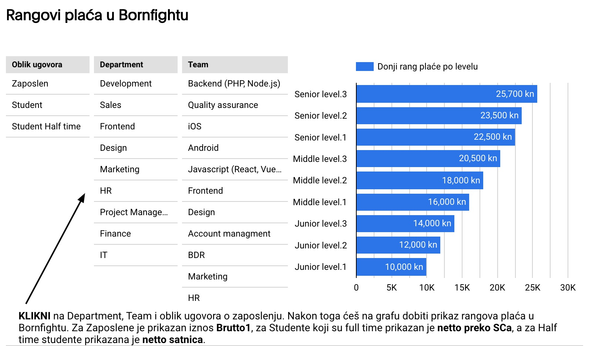

### Recently we have published a great e-book about how we position our team members regarding their seniority.

## The basic idea is there are 3 levels per tier:

-   Junior 1
-   Junior 2
-   Junior 3
-   Mid 1
-   Mid 2
-   Mid 3
-   Senior 1
-   Senior 2
-   Senior 3

## In addition, a possible add-on modifier to your position is:

-   Team Lead 2
-   Team Lead 1
-   Team Lead 3

Which define your role in developing people and making them grow on the seniority scale.

The document is very thorough defining every aspect of every position in detail, in regard to 4 main categories
that can fit into any job description (it doesn't necessarily have to be a dev role, it aims to be agnostic of the
actual job)

> For now, this document is available only in Croatian.

You can download the document from our site at this link:
[Bornfight Seniority](https://www.bornfight.com/careers/senioritet/?utm_source=readme&utm_medium=readme&utm_campaign=Bornfight%20Senioritet)

#### Here you can also see the salary ranges for different teams and departments.

These are well defined and implemented in Bornfight, and are used in defining expectations and personal
development. It looks something like this:

This is a screenshot, the site has the interactive version where you can click through any department and team to
see their salary range.
