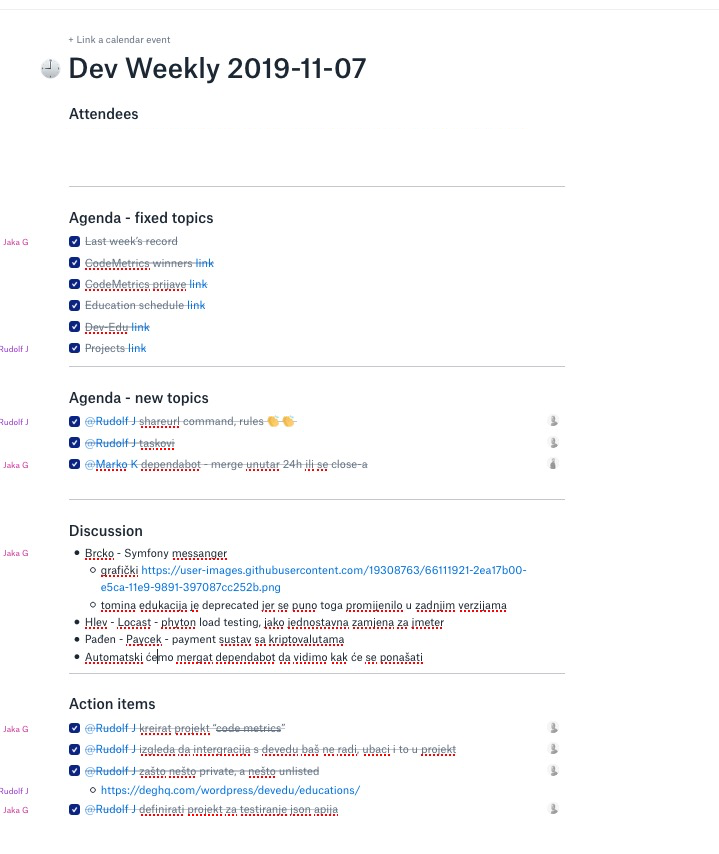

Every Thursday, we have out DevWeekly meet, where the whole team gathers and discusses pressing issues, new stuff, stuff we could improve or implement, internal projects or tools we could make, and lots of other day to day things that happen.

We use [Paper](https://paper.dropbox.com/) for tracking it from week to week, and our template looks like this:

Here a recent meeting to see what it looks like in real life, the strikethrough items are considered done :)

