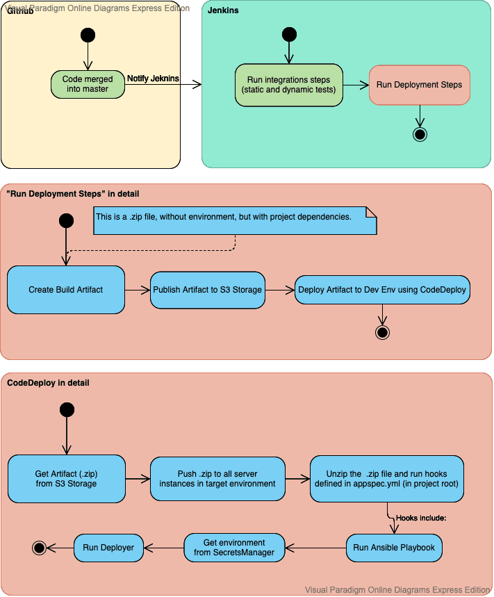

## CodeDeploy and the anatomy of a deploy

Here we will take a deep dive into the deployment implementation details and how your code gets distributed to various environments.

This diagram is a high-level overview of what happens when code gets merged into master. I will try to explain in detail what is going on, and why.

### Everything starts with code getting merged into github.
Github notifies Jenkins that new code is available. Jenkins then starts running static analysis tests and dynamic tests (codeception). If everything went well, Jenkins begins the deployment pipeline steps. 

Here things get interesting.

#### The first step of the deployment pipeline is to create a build artifact. 
This is a single .zip file, which contains all project files and dependencies, but without environment data. 
This means there are no .env.local files here, there are no passwords, there are no private keys here.

#### It is environment-agnostic.  This is an important concept, which yields many benefits. 
The biggest one being, you can deploy the same artifact to any environment, including your own local environment.
This will help you in any crazy corner-case debugging, since you can guaranteed have the same code on your machine as on the production server. 
It also makes builds very fast, since you only need 1 artifact for any environment.

#### Next off, the artifact needs to be published to AWS S3 Storage. 
This is important, because a service later in the pipeline (CodeDeploy) will consume this .zip and it can only consume it from S3. We could have stored the .zip anywhere else, but CodeDeploy service would not have access to the artifact if we did. Hopefully one day we will be able to publish the artifact to Nexus repository manager (backed by S3 storage), should we ever need more complex build arfitact management. S3 web UI is very basic in that regard.

After the .zip has been pushed to S3, Jenkins performs a remote CLI call to AWS CodeDeploy service, kindly requesting a new deploy. CodeDeploy is a service for deploying build arfitacts to EC2 instances. When performing the remote call, Jenkins passes the following information to code deploy:
* The application name (the name of your project)
* The deployment group name (this corresponds to the application environment, and in the case of merges into master – equals to “dev”)
* The S3 path to the .zip build artifact (this is why we needed to upload here)

AWS CodeDeploy receives this request and starts deploying.

First it gets the list of all EC2 server instances which belong to the deployment group (dev). This is a real big feature of CodeDeploy, since we can dynamically add new instances, remove old and never have to maintain an “IP list”. CodeDeploy just knows where it needs to deploy the .zip! Which is one of the strong points of this service in AWS ecosystem.

Next, CodeDeploy notifies the instances that a new revision is available and this fires a series of hooks in the CodeDeploy event lifecycle. Depending on your architecture, there are multiple possible lifecycles, the one we use is “AppSpec ‘hooks’ Section for an EC2/On-Premises Deployment/Without classic load balancer in deployment group”. To see a list of all possible hooks (and more about this service, see https://docs.aws.amazon.com/codedeploy/latest/userguide/reference-appspec-file-structure-hooks.html).

#### The main parts of the CodeDeploy lifecycle hooks are:

* Download and unzip the new artifact
* (Optionally) Run Before Install code (application developer provides code)
* (Optionally) Install code to new directory(application developer provides source and destination folders)
* (Optionally) Run After Install code (application developer provides code)

There is also a hook to ValidateService, which can be configured to do a quick smoke test on the new build. In this script you can detect if the build has failed and CodeDeploy will rollback to the last revision which did not fail during deployment!

The last thing we need to discuss are the two existing hooks which we are using. Please note that the deployment process is constantly being improved, and what is true now may be changed in the future. Always remember, if you see place for improvement – please step up and suggest it! 🙂

We use before-install to run Ansible playbook and provision any server dependencies. This can include “installing pm2 globally, install ModSecurity, password protect our web server”, etc. Anything you would do as part of a “preparation step”. We use ansible here because it is easy to write, simple to understand and is almost self-documenting (see https://deghq.com/wordpress/devedu/executable-documentation/). You could use whatever floats your boat, including bash. But as a very friendly advice, in good faith, give Ansible a try.

Then comes the Install step – and surprise, our Install step does... nothing! 

This is because CodeDeploy is not designed for “single instance, in-place, zero-downtime deploy”. If you want zero-downtime out of the box, then you need to go “blue/green deployment” – which maybe  in the near future we will adopt. 

This kind of deployment completely provisions new  instances, deploys code there and when everything is complete – terminates the old instance and starts routing traffic to the new one. This is kind of link the “releases and symlink” pattern, but at an infrastructure level.
If we would use Install to copy files to some /var/www/html folder, you would have downtime until the files finished copying.

And this is why we in the last step, AfterInstall still use deployer. But before running deployer, remember how the build artifact was built without any environment information? Well now is the time to inject the .env parameters and jwt private keys into the application.

This is done by a simple python script, courtesy of my man JosipT – which you can find here link to script
The script connects to SecretsManager service, a service where we store our environment secrets and private keys, and dumps the secrets from AWS SecretsManager to the EC2 server instance which will be running the application.

The application is now fully armed and ready to be exposed to apache! The only questions remaining without an answer is how to do it, but with zero-downtime?

And for this we are still using deployer, which has a very nice capistrano-like structure of folders, with releases and a symlink to the latest current release. Hopefully we will be able to remove deployer since its only use now is to create release folders and manage a symlink.

And that completes the dev-deployment process!

Deploying to staging and production is very similar, with the only difference being at the very beginning of the pipeline.
 
In this case, you are not running integration tests, and you are not creating a new build artifact. You are reusing an existing build artifact (which was already built in the past, when you merged code into master), and there is no need to run tests again – since this artifact is already tested! This is why you create a release (which is a pointer to an existing commit). When deploying, for example, release tag v1.0.0, Jenkins will just deploy the build artifact which points to the same commit as the release tag points to.

Simple, isn’t it?

Happy developing!

Link to original [blog post](https://deghq.com/wordpress/devedu/codedeploy-and-the-anatomy-of-a-deploy/)🔒
